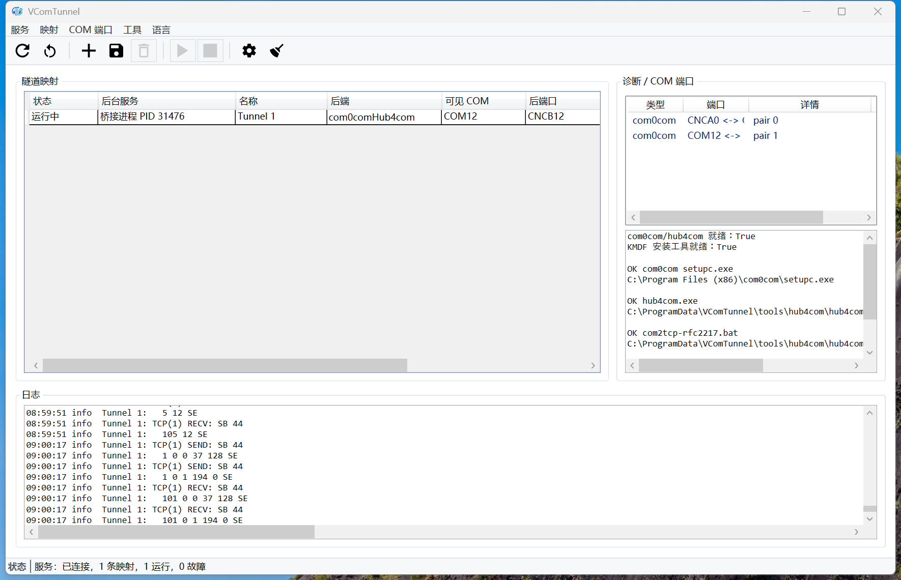

# VComTunnel

[English](README.md) | [简体中文](README.zh-CN.md)

VComTunnel 是一个面向嵌入式开发和实验室设备调试的虚拟串口桥接工具。它让
Windows 上的串口终端、烧录工具、调试工具继续打开本地 `COMx`，然后由本机
服务把数据和串口控制信号转发到远端 RFC2217 设备。

典型场景是 ESP-DAP 或其它网络串口设备已经提供 `rfc2217://host:port`，
但上位机工具仍然只认识本地 COM 口。VComTunnel 负责把这两边接起来，并把
映射配置、后台服务、日志、依赖诊断和 COM 口管理做成一个可操作的桌面工具。

## 当前状态

这个项目目前有三条后端路径：

- `com0comHub4com`：稳定基线。使用 com0com 创建一对虚拟串口，再用
  默认不转发控制线的 hub4com 链路连接 RFC2217 目标。优先推荐这条路径。
- `com0comService`：过渡路径。仍然使用 com0com 提供可见 COM 口，但
  RFC2217 协议由 VComTunnel.Service 自己处理，不再经过 hub4com 进程。
- `kmdf`：实验路径。使用项目里的 KMDF 虚拟串口驱动直接提供 COM 口，
  理论上不再需要 com0com。这个后端还不是生产级签名驱动，只建议在测试机
  上验证。

如果目标是可靠烧录、日志和日常使用，先使用 `com0comHub4com`。如果目标是
验证最终的一步到位虚拟 COM 到 RFC2217，则可以在测试环境里试 `kmdf`。

## 工作方式

```text
串口工具 -> 本地 COMx -> VComTunnel 后端 -> VComTunnel.Service -> RFC2217 host:port
```

三种后端的链路分别是：

```text
com0comHub4com:
串口工具 -> COMx -> com0com -> CNCBx -> hub4com no-control-lines -> RFC2217

com0comService:
串口工具 -> COMx -> com0com -> CNCBx -> VComTunnel.Service -> RFC2217

kmdf:
串口工具 -> COMx -> VComTunnel.Serial.sys -> VComTunnel.Service -> RFC2217
```

GUI 只是控制台和状态面板。映射启动以后可以由后台服务继续运行，关闭 GUI
不会自动停止隧道。

## Windows GUI 实测状态



上图是 Windows 本地实测运行状态。界面显示后台服务已连接，当前共有 1 条映射、
1 条正在运行、0 条故障。运行中的映射名为 `Tunnel 1`，后端为
`com0comHub4com`，可见端口为 `COM12`，com0com 后端口为 `CNCB12`。诊断面板
显示 `com0com/hub4com 就绪: True`、`KMDF 安装工具就绪: True`，并解析到
`setupc.exe` 和 `hub4com.exe` 的实际路径。`com2tcp-rfc2217.bat` 作为可选
legacy wrapper 存在时也会显示，但默认链路不再使用它。日志面板显示 `Tunnel 1`
的 RFC2217 收发记录。

## 已验证的 Windows 构建

以下命令是本地已验证的构建闭环。`dotnet restore` 需要 NuGet 访问权限；
后续 `--no-restore` 命令要求 restore 已经成功完成。

```powershell
dotnet restore VComTunnel.sln
dotnet build -c Release --no-restore VComTunnel.sln
dotnet run -c Release --no-build --project tests\VComTunnel.Tests\VComTunnel.Tests.csproj
scripts\smoke-local.ps1 -Configuration Release -NoBuild
```

`smoke-local.ps1` 会使用临时 loopback 端口和临时 `VCOMTUNNEL_HOME` 启动
console-mode 服务，不会写入已安装的本机服务配置。

启动 GUI 用于本机调试：

```powershell
dotnet run --project src\VComTunnel.Gui\VComTunnel.Gui.csproj
```

如果只想调试本机 API/服务：

```powershell
dotnet run --project src\VComTunnel.Service\VComTunnel.Service.csproj -- --console
```

常用 CLI：

```powershell
dotnet run --project src\VComTunnel.Cli\VComTunnel.Cli.csproj -- diagnose
dotnet run --project src\VComTunnel.Cli\VComTunnel.Cli.csproj -- deps install
dotnet run --project src\VComTunnel.Cli\VComTunnel.Cli.csproj -- status
dotnet run --project src\VComTunnel.Cli\VComTunnel.Cli.csproj -- mappings
```

## 安装依赖

阶段 1 的稳定后端依赖两个第三方组件：

- com0com：创建 Windows 可见的虚拟串口对。
- hub4com：把 com0com 的另一端接到 RFC2217 目标。

VComTunnel 的依赖安装功能会优先使用发布包里的离线归档。仓库内也固定保存了
这两个上游原始归档，路径是 `third_party\dependencies`，这样本地和 GitHub
打包都不需要临时访问 SourceForge。发布脚本会校验归档内容和 SHA256。
如果归档不存在，开发构建才会尝试下载官方 SourceForge 包：

- hub4com 2.1.0.0:
  <https://sourceforge.net/projects/com0com/files/hub4com/2.1.0.0/hub4com-2.1.0.0-386.zip/download>
- com0com 3.0.0.0 signed package:
  <https://sourceforge.net/projects/com0com/files/com0com/3.0.0.0/com0com-3.0.0.0-i386-and-x64-signed.zip/download>
- com0com files index:
  <https://sourceforge.net/projects/com0com/files/>

hub4com 解压后即可使用。com0com 是 Windows 驱动，仍然需要用户批准管理员
权限安装；VComTunnel 可以准备安装包并拉起安装器，但不会绕过 Windows 驱动
安装和签名策略。

GUI 里的 `Setup deps` 会完成依赖准备、诊断刷新和 com0com 安装器拉起。CLI
也可以执行同样的动作：

```powershell
vcomtunnelctl deps install
vcomtunnelctl deps launch-com0com
```

## 创建和删除 COM 口

`com0comHub4com` 和 `com0comService` 都需要一对 com0com 端口：

```text
Visible COM = COM27
Backing     = CNCB27
```

`Visible COM` 是给 esptool、串口终端、IDE 等工具打开的端口；`Backing` 是
VComTunnel 或 hub4com 消费的另一端。

GUI 的 COM 端口面板可以查看、创建和删除 com0com pair。CLI 可以生成计划：

```powershell
vcomtunnelctl create-hints
vcomtunnelctl pair create-plan <mappingId>
vcomtunnelctl pair remove-plan <pairNumber>
```

实际创建/删除 com0com 端口需要管理员确认，因为它会调用 com0com 的
`setupc.exe` 修改驱动设备。

`kmdf` 后端没有 `CNCB` 这一侧。它只有一个可见 COM 口，例如 `COM25`，
服务通过驱动私有通道收发数据。

## 后台服务

VComTunnel.Service 监听本机 `127.0.0.1:44817`，GUI 和 CLI 都通过这个本机
API 管理映射。

安装 Windows 后台服务：

```powershell
vcomtunnelctl service install C:\Tools\VComTunnel\VComTunnel.Service.exe
vcomtunnelctl service start
```

`service install` 也会修复已存在的 `VComTunnel` 服务注册，把 `binPath`
更新为当前传入的 Service 可执行文件路径，然后再启动服务。

卸载或停止：

```powershell
vcomtunnelctl service stop
vcomtunnelctl service uninstall
```

映射里的 `autoStart` 表示服务启动时自动启动该隧道；`restartOnFailure`
表示网络断开或进程退出后尝试重连。

默认启动映射、`autoStart` 和由它产生的自动重连都只负责恢复数据链路，不主动
操作目标控制线。对 `com0comHub4com` 后端，VComTunnel 使用不带 DTR、RTS、
BREAK 和 line-control 转发过滤器的 hub4com 启动方式，避免手动启动、Windows
开机或后台服务恢复时把目标复位或拉进 bootloader。需要 BOOT/RESET 时，应由
后续显式控制动作触发 DTR/RTS，而不是由默认隧道启动隐式完成。

如果确实需要让 hub4com 路径转发控制线，可以在 `com0comHub4com` 映射里设置
`hub4comForwardControlLines: true`。该模式会加入与 `com2tcp-rfc2217.bat`
一致的 `pinmap` 和 `linectl` 过滤器，RTS/DTR/BREAK 以及 line-control 改动
都可能到达目标设备。这个模式不具备 VComTunnel 自己后端的“只抑制启动同步”
钩子，启用前应先在能承受初始控制线状态的硬件上验证。

## 发布安装文件

当前仓库已经提供发布脚本。以下是已验证的 Windows portable 打包命令，输出
用户可以直接解压运行的目录和 `.zip` 包：

```powershell
scripts\package-release.ps1 -Version 1.0.0.rc2 -Runtime win-x64 -Restore
```

默认包是 self-contained，目标机器不需要单独安装 .NET 运行时。用户解压到
可写目录后运行 `Start-VComTunnel-Portable.cmd`，配置、日志、下载文件和工具
缓存会放在发布目录下的 `data` 目录。GUI 会在没有安装 Windows Service 时
自动从同目录拉起 `VComTunnel.Service.exe --console` 后台进程。

不要省略 `-Restore`，除非发布机已经针对目标 RID 完成 runtime-specific
restore。普通 solution restore 不足以生成 `win-x64` publish 所需的 assets。
如果要生成体积更小、但要求目标机器预装 .NET 运行时的包，可以同时加
`-FrameworkDependent`：

```powershell
scripts\package-release.ps1 -Version 1.0.0.rc2 -Runtime win-x64 -Restore
scripts\package-release.ps1 -Version 1.0.0.rc2 -Runtime win-x64 -Restore -FrameworkDependent
```

默认发布脚本会从 `third_party\dependencies` 复制固定的第三方依赖归档。
如果发布机需要使用单独复核过的归档缓存，可以通过 `-DependencyArchiveRoot`
传入同名、同 SHA256 的缓存目录。

发布包会包含：

- GUI、Service、CLI 的发布产物。
- `README-FIRST.txt` 和 `README-FIRST.zh-CN.txt`。
- `Start-VComTunnel.cmd`。
- `Start-VComTunnel-Portable.cmd`。
- `Setup-Dependencies-Portable.cmd`。
- `Install-Windows-Service.cmd` 和 `Uninstall-Windows-Service.cmd`。
- `LICENSE`、`README.md`、`README.zh-CN.md`、`SECURITY.md`。
- `dependencies` 目录下的 com0com/hub4com 归档。
- `THIRD-PARTY-NOTICES.txt`。
- `SHA256SUMS.txt`。

这个脚本当前产出的是 portable zip，适合 GitHub Release 直接挂载给用户下载。
如果要发布“普通用户双击安装”的安装器，使用以下已验证的 Windows Velopack
打包命令：

```powershell
scripts\package-velopack.ps1 -Version 1.0.0.rc2 -Runtime win-x64 -Restore -Msi
```

选择 Velopack 是为了后续跨平台分发保持同一套安装/更新模型：当前 WPF GUI
只能打 Windows 包；等 Avalonia 跨平台 GUI 成为主入口后，同一套 Velopack
流程可以继续覆盖 Windows、macOS 和 Linux。上述 Windows 命令会生成 Velopack
`Setup.exe`、MSI、Velopack portable zip、staged portable zip 和 SHA-256 清单。

公开下载文件会复制到 `artifacts\velopack\public\<runtime>`，并且每个文件名
都会带发布版本号，例如 `VComTunnel-1.0.0.rc2-win-x64-Setup.exe`。
Velopack 原始 update-feed 文件仍保留在 runtime 输出目录，继续使用 Velopack
要求的固定文件名。

非 Windows 安装包当前不作为已验证命令写入 README。后续需要等 Avalonia GUI
成为主入口，并完成 Linux/macOS publish 产物的实际验证后再补充。macOS 安装包
必须在 macOS 上生成，因为需要 Apple 的打包和签名工具。正式公开安装器发布前
应完成代码签名。

MSIX 暂不作为主线，因为 VComTunnel 仍涉及 Windows Service、com0com 驱动安装
和后续 KMDF 签名边界。com0com 继续保留独立驱动安装确认，不静默绕过；KMDF
生产发布前必须解决正式驱动签名，测试签名驱动不能作为普通用户安装包分发。

GitHub Actions 提供线上 Windows 发布路径。`v1.0.0.rc2` 已通过 `Package`
workflow 生成带版本号的公开发布文件。workflow 在 `windows-latest` 上构建、
运行测试、执行 `scripts\package-velopack.ps1`，并把带版本号的公开发布文件
上传为 workflow artifact；tag 触发或手动选择上传时会发布到对应 GitHub
Release。版本号包含 `rc`、`alpha`、`beta`、`pre` 或 `preview` 时会使用
workflow 的 pre-release 标记逻辑；正式发布前需要在 GitHub Release 页面确认
该标记。当前线上打包仍是 Windows-only，等 Avalonia GUI 有 Linux/macOS publish
产物并完成验证后再扩展矩阵。

## KMDF 驱动

KMDF 驱动代码在 `drivers\VComTunnel.Serial`。它的目标是让 VComTunnel 自己
提供虚拟串口，不再依赖 com0com/hub4com。

构建和安装测试驱动需要 WDK、测试签名环境和管理员权限。相关脚本：

```powershell
drivers\VComTunnel.Serial\build-driver.ps1
drivers\VComTunnel.Serial\install-test-driver.ps1
```

注意：测试签名驱动只适合开发验证。正式发布需要走 Microsoft 驱动签名流程，
否则普通 Windows 机器无法按生产方式安装。

GUI 的“安装依赖”不会自动安装 KMDF 驱动。只有用户主动选择 `kmdf` 映射，并创建
或更新该 KMDF 端口时，才会显示实验性/测试签名驱动确认提示。Windows 可能需要
启用测试签名模式并重启；开启 Secure Boot 或驱动签名策略可能会阻止安装。

## RFC2217 验证

可以使用 smoke 工具直接探测 RFC2217 endpoint：

```powershell
dotnet run -c Release --project tools\VComTunnel.Smoke\VComTunnel.Smoke.csproj -- --probe-rfc2217 10.0.2.196 5000
```

安全探测设置 ACK：

```powershell
dotnet run -c Release --project tools\VComTunnel.Smoke\VComTunnel.Smoke.csproj -- --probe-rfc2217 10.0.2.196 5000 --probe-settings --probe-query
```

只有确认目标设备可以被复位或扰动时，才使用 `--probe-controls`，因为 DTR、
RTS、BREAK、purge 等控制可能影响连接的开发板。

## 安全边界

- 本机 API 只应监听 `127.0.0.1`。
- RFC2217 本身没有 TLS 和认证，默认只适合可信局域网或实验室网络。
- 不要把 VComTunnel 的 API 或 RFC2217 设备直接暴露到不可信网络。
- 驱动、COM 口创建和控制线时序都可能影响真实硬件，升级前先用安全目标验证。
- 映射启动、`autoStart` 和自动恢复默认都不转发 DTR/RTS/BREAK；目标复位和进
  bootloader 应来自明确的手动或工具动作。

## 贡献

欢迎围绕串口工具兼容性、RFC2217 互操作、诊断、打包、文档和跨平台 GUI
继续完善。提交前请先阅读 [CONTRIBUTING.md](CONTRIBUTING.md)。

## 许可证

VComTunnel 使用 MIT License 发布，详见 [LICENSE](LICENSE)。
